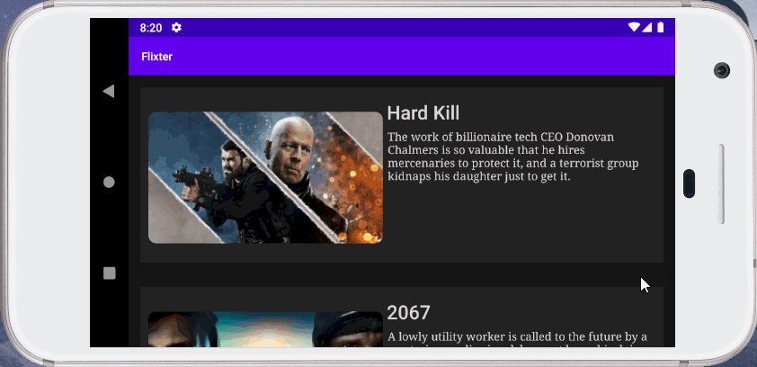

# Flix
Flix is an app that allows users to browse movies from the [The Movie Database API](http://docs.themoviedb.apiary.io/#).

## Flix Part 2

### User Stories

#### REQUIRED (10pts)

- [x] (8pts) Expose details of movie (ratings using RatingBar, popularity, and synopsis) in a separate activity.
- [x] (2pts) Allow video posts to be played in full-screen using the YouTubePlayerView.

#### BONUS

- [x] Implement a shared element transition when user clicks into the details of a movie (1 point).
- [x] Trailers for popular movies are played automatically when the movie is selected (1 point).
  - [x] When clicking on a popular movie (i.e. a movie voted for more than 5 stars) the video should be played immediately.
  - [x] Less popular videos rely on the detailed page should show an image preview that can initiate playing a YouTube video.
- [ ] Add a play icon overlay to popular movies to indicate that the movie can be played (1 point).
- [ ] Apply the popular ButterKnife annotation library to reduce view boilerplate. (1 point)
- [x] Add a rounded corners for the images using the Glide transformations. (1 point)

### App Walkthough GIF

 
 

### Notes

While building the second portion of the app, I had noticed that I made some erroneous mistakes from the previous portion. The biggest mistake I made was hardcoding the image view for the main activity page. This lead the landscape view to improperly display the poster image instead of the backdrop image. This was a simple fix, however. I did struggle to implement data binding and was unable to properly integrate the system across all of my activities.

---

## Flix Part 1

### User Stories

#### REQUIRED (10pts)
- [x] (10pts) User can view a list of movies (title, poster image, and overview) currently playing in theaters from the Movie Database API.

#### BONUS
- [x] (2pts) Views should be responsive for both landscape/portrait mode.
   - [x] (1pt) In portrait mode, the poster image, title, and movie overview is shown.
   - [x] (1pt) In landscape mode, the rotated alternate layout should use the backdrop image instead and show the title and movie overview to the right of it.

- [x] (2pts) Display a nice default [placeholder graphic](https://guides.codepath.org/android/Displaying-Images-with-the-Glide-Library#advanced-usage) for each image during loading
- [ ] (2pts) Improved the user interface by experimenting with styling and coloring.
- [ ] (2pts) For popular movies (i.e. a movie voted for more than 5 stars), the full backdrop image is displayed. Otherwise, a poster image, the movie title, and overview is listed. Use Heterogenous RecyclerViews and use different ViewHolder layout files for popular movies and less popular ones.

### App Walkthough GIF
 
 

### Notes
During the first part of this assignment, I did have a little bit of trouble formatting my design in a manner such that the text was not overflowing onto the next section (for portrait mode). I decided to use the 'maxHeight' and 'maxLines' properties to fix this issue. As developers, we need to be aware of the size of the data that we are trying to display, and subsequently code for fringe cases where we have too much or too little data.

### Open-source libraries used

- [Android Async HTTP](https://github.com/codepath/CPAsyncHttpClient) - Simple asynchronous HTTP requests with JSON parsing
- [Glide](https://github.com/bumptech/glide) - Image loading and caching library for Androids
